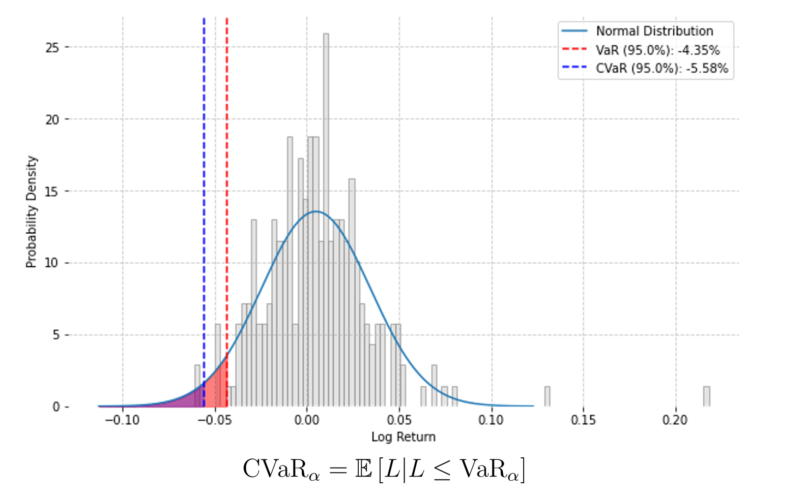

# Conditional Value-at-Risk (CVaR)

[**Value-at-Risk (VaR)**](https://en.wikipedia.org/wiki/Value_at_risk) is a widely used risk measure that estimates the potential loss in value of a portfolio over a defined time horizon, given a specific confidence level. VaR answers the question: "*What is the maximum loss that could occur with a certain probability over a given period?*"

While useful, VaR has several drawbacks that make it less suitable for portfolio optimization computations. These include a lack of sensitivity to tail risk, violation of subadditivity (which can penalize diversification), and the fact that it often leads to non-convex optimization problems, which are more difficult to solve reliably.

[**Conditional Value-at-Risk (CVaR)**](https://en.wikipedia.org/wiki/Expected_shortfall) addresses these issues. It is defined as the average of all losses that exceed the VaR threshold, making it particularly effective for capturing the risk of extreme losses and providing a clearer picture of potential worst-case outcomes. Additionally, CVaR is a coherent risk measure, satisfying key mathematical properties such as subadditivity, monotonicity, and positive homogeneity, making it both theoretically sound and practically effective for optimization.



This image illustrates the distribution of historical daily log-returns over a given period. The **95% VaR** (vertical dashed line) indicates that, with 95% confidence, the portfolio is not expected to lose more than 4.35% in a single day. The 95% CVaR (shaded region) measures the average loss in the worst 5% of cases, estimated at 5.58% per day.

# Mean-CVaR Problem

The Mean-CVaR optimization problem can be formulated as below. 


# Usage
Notebooks in this repo provide step-by-step guide on running a portfolio optimization using cuFOLIO.
1. [Optimization with cuFOLIO](01_optimization_with_cufolio.ipynb):
This notebook demonstrates leveraging cuFOLIO's GPU acceleration for optimization and the performance gain over CPU-based methods.
2. [Backtesting](02_backtesting.ipynb):
This notebook provides a framework for backtesting strategies, allowing users to analyze historical performance.
3. [Advanced topics](03_advanced_topics.ipynb):
This notebook contains advanced topics including portfolio rebalancing strategies to maintain optimal asset allocation.

# Configure Host Networking
Edit your `/etc/hosts` file to map the `cuopt` hostname to your host machine's IP address. This allows the PyTorch container to communicate with the cuOpt service.

   ```bash
   sudo nano /etc/hosts
   ```

   Add a line like this (replace the IP with your actual host IP):

   ```
   192.168.1.123    cuopt
   ```
