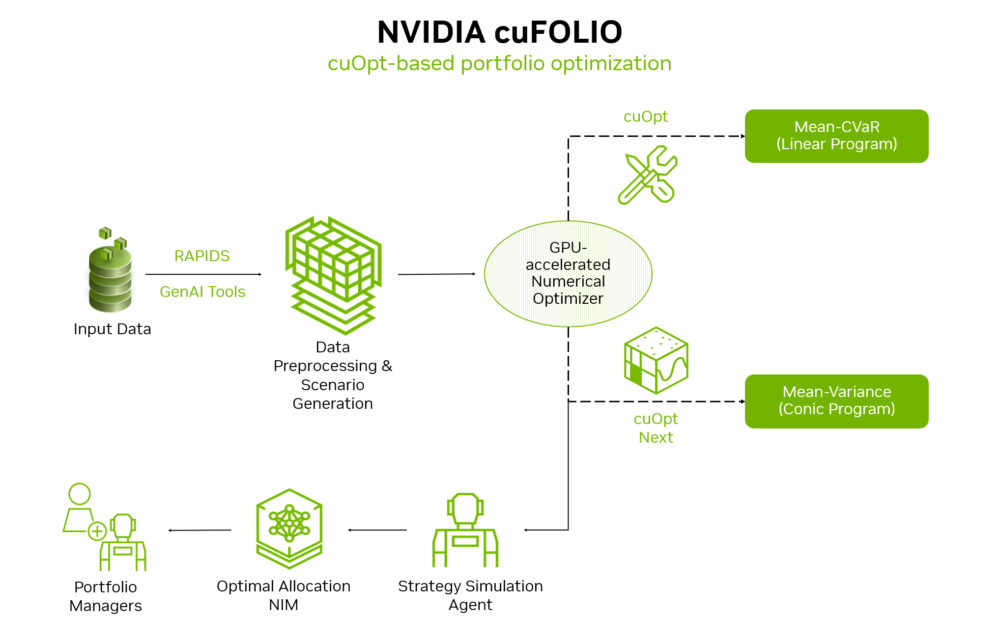
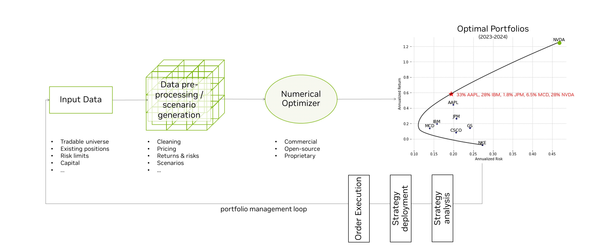

# cuFOLIO: GPU-Accelerated Portfolio Optimization

cuFOLIO is a GPU-accelerated computing library designed to speed up investment portfolio construction and management. cuFOLIO leverages NVIDIA's cutting-edge cuOpt technology to deliver substantial performance gains in portfolio optimization.

Portfolio optimization is a key component of portfolio construction. The full workflow is illustrated below, and other NVIDIA libraries can be leveraged to accelerate the pre- and post-optimization steps.

## Portfolio Management and Optimization

Effective portfolio management is fundamental for investment-focused institutions, including buy-side and sell-side operations across various asset classes. It involves the strategic creation, allocation, and management of financial asset portfolios, aiming to balance risk and return to achieve specific investment objectives. As financial markets become increasingly complex and diverse, the necessity for advanced portfolio optimization techniques and tools has grown correspondingly.

A central aspect of portfolio management is [**Portfolio Optimization**](https://en.wikipedia.org/wiki/Portfolio_optimization), which focuses on constructing portfolios that maximize expected returns for a given level of risk. This process entails solving high-dimensional numerical optimization problems that are computationally intensive.

GPU-accelerated solutions allow financial institutions to navigate the complexities of modern markets more effectively, optimizing portfolio performance while managing risk with greater precision.

## Portfolio Optimization Workflow

## cuOpt for GPU-Accelerated Optimization

cuFOLIO utilizes [NVIDIA cuOpt](https://www.nvidia.com/en-us/ai-data-science/products/cuopt/), a GPU-accelerated solver for decision optimization.

## Optimization Methods

The current implementation of cuFOLIO supports [Conditional Value-at-Risk (CVaR)](CVaR/) as the risk measure, with support for mean-variance optimization planned for future development.

### CVaR

[**CVaR**](https://en.wikipedia.org/wiki/Expected_shortfall), also known as Expected Shortfall, provides a more comprehensive view of tail risk than traditional [Value-at-Risk (VaR)](https://en.wikipedia.org/wiki/Value_at_risk). While VaR estimates the maximum expected loss at a given confidence level (e.g., 95%), it doesn't take the magnitude of losses beyond that threshold into account. In contrast, CVaR captures the average of those extreme losses that exceed the VaR cutoff, offering a more robust and informative measure of downside risk. This makes CVaR particularly valuable for understanding true risk exposure.

### Mean-Variance Optimization (Future Development)

[**Mean-variance optimization**](https://en.wikipedia.org/wiki/Modern_portfolio_theory), pioneered by Harry Markowitz, evaluates portfolios by balancing expected return against variance, providing a trade-off between risk and return. Mean-variance optimization is a quadratic problem and not supported in cuFOLIO at this time.